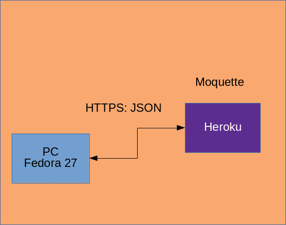

# Idiot BGT

Merupakan project seneng-seneng dari [Labseni](https://labseni.herokuapp.com/techneandpraxis/2018/02/11/Paho-dan-Java.html) yang semoga bisa menjadi karya yang bagus.


## Arsitektur


## Install 

```bash
git clone https://github.com/faoziaziz/IdiotBGT.git tutLabseni
cd tutLabseni/idiotBGT
```
download semua dependency biar nanti bisa dikerjain offline dikosan biar hemat

```bash 
mvn dependency:go-offline
```
lalu install
```bash
mvn -o install
```
Sekarang kita akan jalankan programnya
```bash
mvn exec:java -Dexec.mainClass=org.labseni.App
```

## Referensi 
1. [Playing around MQTT](http://www.hascode.com/2016/06/playing-around-with-mqtt-and-java-with-moquette-and-eclipse-paho/)

